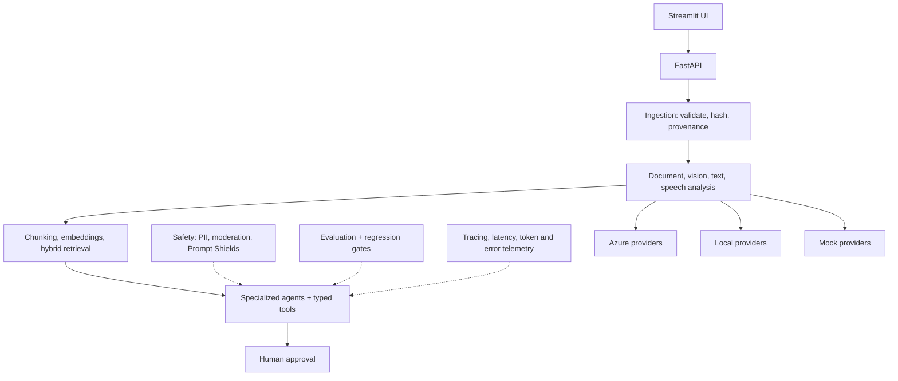

# LoopLine Resolve AI

A multimodal warranty-claims and repair copilot built with Microsoft Foundry, Python, retrieval-augmented generation, specialized agents, document extraction, vision, language intelligence, responsible AI controls, and human approval.

> Status: project scaffold only. No pipeline, provider, or agent logic is implemented yet — see the phase plan below.

## The problem

LoopLine Electronics sells refurbished phones, laptops, and headphones in France and nearby European markets. Warranty claims currently require an employee to read the claim form, verify the receipt, extract the serial number, inspect photos/video, listen to voice messages, translate French/English messages, search policies and manuals, check parts/pricing/service-center availability, and write a response. LoopLine Resolve AI assists this process — it does not autonomously approve refunds, reject claims, or make safety-critical decisions; a human always approves consequential outcomes.

## What the system will do

1. Take in a claim: form details, receipt, photos, audio, optional video.
2. Extract structured evidence with confidence scores and source references.
3. Retrieve grounded policy/manual knowledge through hybrid search.
4. Route the case through specialized agents with typed tools.
5. Apply responsible AI checks (PII, moderation, prompt-injection defense).
6. Produce a cited resolution proposal that requires human approval before any customer-facing action.

## Architecture



Every provider (Azure, local, mock) implements the same stable Python interface, so the app can run entirely offline against synthetic fixtures. See the full capstone guide for the layer-by-layer breakdown.

## AI-103 skills demonstrated

| Measured domain | Project proof |
| --- | --- |
| Plan and manage an Azure AI solution | Service/model selection, deployment planning, quotas, cost controls, RBAC, managed identity, CI/CD, monitoring, evaluation |
| Generative AI and agentic solutions | Foundry model use, structured generation, RAG, tools, specialized agents, orchestration, human approval |
| Computer vision solutions | Damage analysis, OCR, captions, alt text, visual Q&A, unsafe-image checks, indirect prompt injection |
| Text analysis solutions | Language detection, NER, PII, sentiment, key phrases, summarization, translation, speech-to-text/text-to-speech |
| Information extraction solutions | PDF/form/receipt extraction, OCR, layout, fields, confidence scores, chunking, vector indexing, hybrid retrieval |

## Key engineering decisions

- Human approval is required for every financial or safety-critical action.
- Raw customer evidence is immutable; generated media is stored separately and watermarked.
- Extracted facts always preserve a source reference.
- The LLM never writes directly to business records — tools return typed JSON.
- Azure, local, and mock providers share one interface and produce the same application schema.

## Technology stack

Python, FastAPI, Streamlit, Microsoft Foundry, Azure AI Search, Document Intelligence, Azure AI Language, Azure Speech, Azure Translator, Azure AI Content Safety.

## Repository layout

See [`LoopLine-Resolve-AI-AI103-Capstone-Guide.md`](LoopLine-Resolve-AI-AI103-Capstone-Guide.md) Section 12 for the full annotated repository structure and Section 19 for the phase-by-phase build plan.

## Local setup

```bash
uv venv --python 3.12 .venv
source .venv/bin/activate
uv pip install -e ".[dev]"
cp .env.example .env   # defaults to APP_PROVIDER_MODE=mock, no secrets required
pytest -q
uvicorn app.api.main:app --reload
streamlit run ui/streamlit_app.py
```

## Sample data

Synthetic, deterministic fixtures (56+ files across six end-to-end claim cases) live in [`LoopLine-Resolve-AI-Mock-Dataset/`](LoopLine-Resolve-AI-Mock-Dataset/) and are also reachable at [`sample-data/`](sample-data/). No real personal information is used.

## License

MIT — see [LICENSE](LICENSE).
