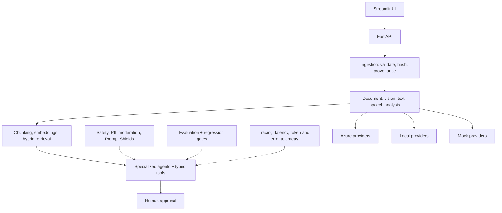

# Architecture

## Overview

Every provider (Azure, local, mock) implements the same protocol defined in
`app/providers/protocols.py`, so the application layer above it never branches
on which provider is active — only `app/core/config.py`'s `app_provider_mode`
setting changes what gets constructed underneath.

## Layers

| Layer | Responsibility | Code |
| --- | --- | --- |
| Streamlit UI | Portfolio demo interface | `ui/streamlit_app.py` |
| FastAPI | API contracts, validation, orchestration endpoints | `app/api/` |
| Domain layer | Claims, evidence, resolutions, approvals | `app/domain/` |
| Provider layer | Azure, local, or mock service implementations | `app/providers/` |
| Ingestion pipeline | Validation, hashing, provenance, storage | `app/ingestion/` |
| Extraction pipeline | Field normalization, confidence bands | `app/extraction/` |
| Retrieval layer | Chunking, embeddings, indexing, hybrid search | `app/retrieval/` |
| Agent layer | Specialized agents, tool routing, state machine | `app/agents/` |
| Safety layer | PII, moderation, injection checks, approval constraints | `app/safety/` |
| Evaluation layer | Offline tests, AI-assisted evaluation, regression gates | `app/evaluation/` |

## Key design rules

- Raw customer evidence is immutable.
- Generated media is stored separately and watermarked.
- Extracted facts preserve source references.
- The LLM never directly writes to business records.
- Tools return typed JSON.
- Financial and safety actions require human approval.
- All providers share stable Python interfaces; local and mock modes produce
  the same application schemas as Azure mode.
- The application never exposes hidden chain-of-thought; it returns short
  evidence-based reasons.

## Azure footprint (as of Phase 2)

One resource group, `rg-adam.jouaid123-8353` (Sweden Central), holds
everything this project provisions:

| Resource | Name | Status |
| --- | --- | --- |
| Foundry account | `adamjouaid123-2390-resource` | Created |
| Foundry project | `adamjouaid123-2390` | Created |
| Chat/multimodal deployment | `gpt-5-mini` (GlobalStandard) | Deployed |
| Embedding deployment | `text-embedding-3-large` (Standard) | Deployed |
| Azure AI Search | `loopline-search-adamj` (Free) | Created |
| Storage account | `looplineresolvedatadev` | Templated in `infra/main.bicep`, not yet deployed (Phase 4) |
| Document Intelligence, Language, Content Safety, Translator | — | F0 confirmed available, not yet created (deferred to their phases) |

See `docs/adr/002-service-selection.md` for the reasoning behind each choice,
and `docs/cost-and-cleanup.md` for the spending ceiling and cleanup plan.

## Infrastructure as code

`infra/main.bicep` documents the storage account and references the
already-existing Search service via an `existing` resource block, so
`az deployment group what-if` proves the template matches reality before
anything is deployed for real. The Foundry account/project and Search service
were created via portal/CLI during Phase 0 exploration, before the template
existed; going forward, new stable resources are added to the template first.

## What a production version would add (not built here)

Per ADR 002, the following are deliberately out of scope for this capstone,
but are the answer to "what would you change for production":

- Private endpoints for Storage, Search, and Cognitive Services
- VNET-integrated Container Apps instead of local/consumption hosting
- Azure Front Door or API Management in front of the FastAPI service
- Customer-managed keys for encryption at rest
