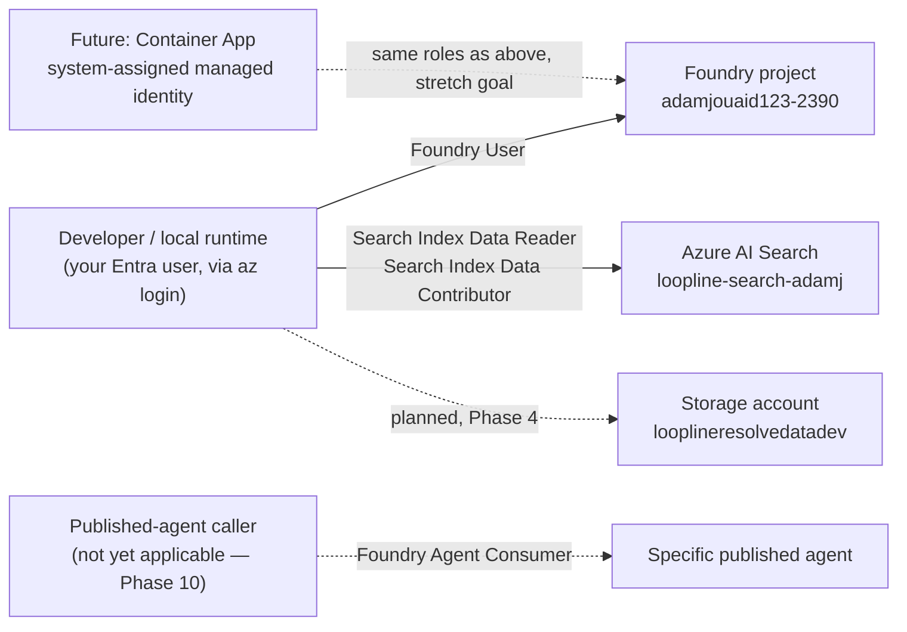

# RBAC matrix

## Identity model

Right now, "developer" and "runtime" are the same principal: your own Entra
user, authenticated locally via `az login` and consumed by the app through
`DefaultAzureCredential`. There is no deployed service yet, so there is no
separate managed identity — but every role below is assigned at the same
narrow scope a managed identity would eventually receive, so promoting to a
real runtime identity later is a matter of re-pointing the assignment, not
redesigning it.

## Matrix

| Identity | Role | Scope | Status |
| --- | --- | --- | --- |
| Your Entra user (dev + local runtime) | Foundry User | Project `adamjouaid123-2390` | Assigned |
| Your Entra user (dev + local runtime) | Search Index Data Reader | Search service `loopline-search-adamj` | Assigned |
| Your Entra user (dev + local runtime) | Search Index Data Contributor | Search service `loopline-search-adamj` | Assigned |
| Your Entra user (dev + local runtime) | Storage Blob Data Contributor | Storage account `looplineresolvedatadev` | Planned — Phase 4, once the account exists |
| Future Container App identity | Foundry User, Search roles, Storage roles | Same scopes as above | Not created — only if the optional Container Apps stretch goal is built |
| Published-agent caller | Foundry Agent Consumer | Specific agent | Not applicable yet — no agents published (Phase 10) |
| GitHub Actions CI | none | — | CI runs mock-only; no Azure credentials are given to CI (see ADR 003) |

## What this deliberately excludes

No principal in this project — including your own user, for the purposes of
how the *application* authenticates — is assigned `Owner` or `Contributor` at
the resource or resource-group level for application access. Your personal
Owner role on the subscription is what let you create resources and role
assignments in the first place, but it's orthogonal to this matrix: the app's
credential chain only ever exercises the narrow roles listed above.

## Verifying this matrix

`scripts/check_access.py` independently exercises the Foundry and Search rows
above (acquiring a real token / making a real data-plane call, not just
checking that `az role assignment create` didn't error) and reports Storage as
skipped until Phase 4.
